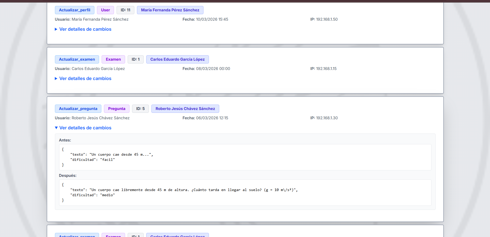

# Colegio Max Planck — Sistema de Gestión Académica Integral

### Plataforma web completa para colegios: Usuarios, Cursos, Matrículas, Exámenes Online con Temporizador, Calificaciones en Base 20, Auditoría de Accesos, Notificaciones por Correo, API REST y más.

[](https://laravel.com)
[](https://php.net)
[](https://tailwindcss.com)
[](https://sqlite.org)
[]()
[]()

---

> **¿Buscas un sistema académico completo y funcional?** Este proyecto incluye todo lo que un colegio necesita: gestión de usuarios con 3 roles, matrículas, banco de preguntas con imágenes, exámenes en línea con temporizador e intentos configurables, calificaciones automáticas en base 20, auditoría completa de accesos y acciones, notificaciones por correo electrónico, API REST con autenticación por tokens, 57 tests automatizados con CI/CD, y diseño responsive. **Listo para clonar y usar.**

### Características Principales

| Característica | Descripción |
|---|---|
| **3 Roles (Admin, Docente, Estudiante)** | Cada rol con su propio dashboard, menú y permisos controlados por middleware y policies |
| **Exámenes Online** | Temporizador en tiempo real, múltiples intentos, autocorrección, nota en base 20 |
| **Calificaciones Automáticas** | Notas calculadas automáticamente con promedio por curso y estado aprobado/desaprobado |
| **Auditoría Completa** | Log de accesos, cambios de rol, historial de acciones de cada usuario |
| **Notificaciones por Correo** | Emails automáticos al publicar exámenes, confirmar matrículas y obtener resultados |
| **Seguridad** | Bloqueo tras 5 intentos fallidos, cierre por inactividad, rate limiting, Sanctum |
| **API REST** | 9 endpoints autenticados con Sanctum para integrar con apps móviles u otros sistemas |
| **57 Tests + CI/CD** | Tests de cada módulo con GitHub Actions ejecutándose en cada push y PR |
| **Diseño Responsive** | Interfaz adaptable a escritorio, tablet y móvil con menú hamburguesa |
| **Instalación en minutos** | SQLite incluido, un solo comando para migrar y cargar datos de prueba |

---

## Capturas de Pantalla

### Dashboard del Administrador
<p align="center">
  
</p>

### Gestión de Usuarios
<p align="center">
  
</p>

### Banco de Preguntas
<p align="center">
  
</p>

### Auditoría del Sistema
<p align="center">
  
</p>

---

## Tabla de Contenidos

- [Características Principales](#-características-principales)
- [Capturas de Pantalla](#-capturas-de-pantalla)
- [Requisitos Previos](#requisitos-previos)
- [Instalación](#instalación)
- [Configuración del Entorno](#configuración-del-entorno)
- [Usuarios de Prueba](#usuarios-de-prueba)
- [Comandos Útiles](#comandos-útiles)
- [Estructura del Proyecto](#estructura-del-proyecto)
- [Roles y Funcionalidades](#roles-y-funcionalidades)
- [API REST](#api-rest)
- [Tests](#tests)
- [Tecnologías](#tecnologías)

---

## Requisitos Previos

| Software | Versión mínima |
|----------|---------------|
| PHP      | 8.2           |
| Composer | 2.x           |
| Node.js  | 20.x          |
| npm      | 10.x          |
| SQLite   | 3.x (incluido en PHP) |

> **Nota:** El proyecto usa SQLite por defecto. No necesitas instalar MySQL ni PostgreSQL.

### Extensiones PHP requeridas

```
mbstring, sqlite3, pdo_sqlite, fileinfo, openssl, tokenizer, xml, ctype, json
```

Si usas **XAMPP**, estas extensiones ya vienen habilitadas. Si usas PHP standalone, verifica que estén activas en tu `php.ini`.

---

## Instalación

### 1. Clonar el repositorio

```bash
git clone https://github.com/saulPariona/Sistema-de-Gestion-Academica-Integral.git
cd ColegioMaxPlanck
```

### 2. Instalar dependencias de PHP

```bash
composer install
```

### 3. Instalar dependencias de Node.js

```bash
npm install
```

### 4. Configurar el archivo de entorno

```bash
cp .env.example .env
php artisan key:generate
```

### 5. Crear la base de datos SQLite (Solo si no se a creado)

```bash
# En Windows (PowerShell):
New-Item -Path database/database.sqlite -ItemType File

# En Linux/Mac:
touch database/database.sqlite
```

### 6. Ejecutar las migraciones y seeders

```bash
php artisan migrate --seed
```

Esto creará todas las tablas y cargará datos de prueba: **52 usuarios**, **12 cursos**, **40 exámenes**, **80 preguntas** con alternativas, intentos simulados y más.

### 7. Crear el enlace simbólico de storage

```bash
php artisan storage:link
```

### 8. Compilar los assets del frontend

```bash
npm run build
```

### 9. Iniciar el servidor

**Opción A — Solo el servidor:**
```bash
php artisan serve
```
Abre http://localhost:8000 en tu navegador.

**Opción B — Servidor + Cola + Vite (desarrollo):**
```bash
composer run dev
```
Esto ejecuta simultáneamente el servidor, el worker de colas (para notificaciones por correo) y Vite en modo desarrollo con hot reload.

---

## Configuración del Entorno

El archivo `.env.example` viene preconfigurado para funcionar inmediatamente con SQLite. Las variables más relevantes:

```env
APP_NAME="Colegio Max Planck"     # Nombre de la aplicación
APP_URL=http://localhost:8000      # URL base

DB_CONNECTION=sqlite               # Base de datos (no cambiar)

MAIL_MAILER=log                    # Correos se guardan en storage/logs/laravel.log
QUEUE_CONNECTION=database           # Cola para notificaciones asíncronas
```

### Configurar correo real (opcional)

Si deseas enviar correos reales (notificaciones de exámenes, matrículas, resultados), configura un servicio SMTP:

```env
MAIL_MAILER=smtp
MAIL_HOST=smtp.mailtrap.io
MAIL_PORT=2525
MAIL_USERNAME=tu_usuario
MAIL_PASSWORD=tu_password
MAIL_FROM_ADDRESS="noreply@colegiomp.edu.pe"
MAIL_FROM_NAME="Colegio Max Planck"
```

---

## Usuarios de Prueba

Después de ejecutar `php artisan migrate --seed`, puedes ingresar con estos usuarios:

| Rol             | Email                          | Contraseña   |
|-----------------|--------------------------------|-------------|
| Administrador   | `admin@colegiomp.edu.pe`       | `Admin1234` |
| Docente         | `carlos.garcia@colegiomp.edu.pe` | `Docente1234` |
| Estudiante      | `luis.ramirez@colegiomp.edu.pe`  | `Alumno1234`  |

> Todos los docentes usan la contraseña `Docente1234` y todos los estudiantes `Alumno1234`.

---

## Comandos Útiles

```bash
# Reinstalar la base de datos desde cero con datos de prueba
php artisan migrate:fresh --seed

# Ejecutar los tests
php artisan test

# Limpiar cachés
php artisan config:clear && php artisan cache:clear && php artisan view:clear

# Compilar assets para producción
npm run build

# Ejecutar el worker de colas (necesario para notificaciones por correo)
php artisan queue:listen
```

---

## Estructura del Proyecto

```
app/
├── Events/                     # Eventos del dominio
│   ├── EstudianteMatriculado.php
│   ├── ExamenPublicado.php
│   └── IntentoFinalizado.php
├── Http/
│   ├── Controllers/
│   │   ├── Admin/              # 8 controladores (Dashboard, Usuarios, Periodos, Cursos, Matrículas, Apoderados, Calificaciones, Auditoría)
│   │   ├── Api/                # 3 controladores REST (Auth, Estudiante, Docente)
│   │   ├── Auth/               # LoginController (login, logout, reset password)
│   │   ├── Docente/            # 4 controladores (Dashboard, Preguntas, Exámenes, Observaciones)
│   │   └── Estudiante/         # 4 controladores (Dashboard, Exámenes, Calificaciones, Perfil)
│   ├── Middleware/
│   │   ├── CheckBloqueado.php          # Bloquea usuarios inactivos
│   │   ├── InactividadMiddleware.php   # Cierra sesión por inactividad
│   │   ├── RegistrarAcceso.php         # Registra último acceso en auditoría
│   │   └── RoleMiddleware.php          # Control de acceso por rol
│   └── Requests/               # Form Requests con validación (Admin, Auth, Docente, Estudiante)
├── Listeners/                  # Listeners que envían notificaciones (con ShouldQueue)
├── Models/                     # 13 modelos Eloquent
├── Notifications/              # 3 notificaciones por correo (Examen, Matrícula, Resultado)
├── Observers/                  # ExamenObserver (auditoría automática)
├── Policies/                   # Políticas de autorización (Curso, Examen, Pregunta)
└── Services/
    └── AuditoriaService.php    # Servicio centralizado de auditoría

database/
├── migrations/                 # 16 migraciones
└── seeders/                    # 7 seeders con datos realistas

resources/views/
├── admin/                      # Vistas del administrador
├── auth/                       # Login, forgot/reset password
├── docente/                    # Vistas del docente
├── estudiante/                 # Vistas del estudiante
└── layouts/
    └── app.blade.php           # Layout principal responsive

routes/
├── api.php                     # 9 endpoints REST con Sanctum
└── web.php                     # Rutas web con middleware de roles

tests/Feature/                  # 57 tests (Admin, Auth, Docente, Estudiante, Policies)
```

---

## Roles y Funcionalidades

### Administrador (`/admin`)

| Módulo          | Funcionalidades |
|-----------------|-----------------|
| **Dashboard**   | Estadísticas generales del sistema |
| **Usuarios**    | CRUD de usuarios, activar/desactivar, restablecer contraseña, asignar roles |
| **Periodos**    | Crear y editar periodos académicos (con fechas de inicio y fin) |
| **Cursos**      | CRUD de cursos, asignar docente a cada curso |
| **Matrículas**  | Matricular estudiantes en cursos (con validación de duplicados) |
| **Apoderados**  | Registrar apoderados vinculados a estudiantes |
| **Calificaciones** | Vista general de notas por curso y periodo |
| **Auditoría**   | Log de accesos, cambios de rol e historial de acciones |

### Docente (`/docente`)

| Módulo            | Funcionalidades |
|-------------------|-----------------|
| **Mis Cursos**    | Ver cursos asignados y lista de estudiantes matriculados |
| **Banco de Preguntas** | CRUD de preguntas con 4 alternativas (soporta imágenes) |
| **Exámenes**      | Crear exámenes, asignar preguntas del banco, configurar puntaje/tiempo/intentos |
| **Publicar/Cerrar** | Publicar examen (notifica a estudiantes por correo) y cerrar cuando termine |
| **Resultados**    | Ver resultados por examen, detalle por estudiante con respuestas |
| **Observaciones** | Registrar observaciones conductuales de estudiantes |
| **Exportar Notas** | Descargar CSV con notas en base 20 de todos los estudiantes del curso |

### Estudiante (`/estudiante`)

| Módulo            | Funcionalidades |
|-------------------|-----------------|
| **Mis Cursos**    | Ver cursos donde está matriculado |
| **Exámenes**      | Ver exámenes disponibles, intentos restantes, rendir exámenes con temporizador |
| **Resultados**    | Ver resultado inmediato al finalizar (nota en base 20, respuestas correctas/incorrectas) |
| **Calificaciones** | Resumen de notas por curso con promedio y estado aprobado/desaprobado |
| **Mi Perfil**     | Editar datos personales y foto de perfil |
| **Contraseña**    | Cambiar contraseña desde el menú |

---

## API REST

La API usa autenticación con **Laravel Sanctum** (Bearer Token). Base URL: `http://localhost:8000/api`

### Autenticación

| Método | Endpoint       | Descripción               | Auth |
|--------|---------------|---------------------------|------|
| POST   | `/api/login`  | Iniciar sesión, obtener token | No  |
| POST   | `/api/logout` | Cerrar sesión, revocar token  | Sí  |
| GET    | `/api/me`     | Datos del usuario autenticado | Sí  |

**Ejemplo de login:**
```bash
curl -X POST http://localhost:8000/api/login \
  -H "Content-Type: application/json" \
  -d '{"email": "admin@colegiomp.edu.pe", "password": "Admin1234"}'
```

**Respuesta:**
```json
{
  "token": "1|abc123...",
  "user": { "id": 1, "nombres": "Admin", "rol": "administrador" }
}
```

**Usar el token en las siguientes peticiones:**
```bash
curl http://localhost:8000/api/me \
  -H "Authorization: Bearer 1|abc123..."
```

### Endpoints de Estudiante

| Método | Endpoint                                | Descripción |
|--------|-----------------------------------------|-------------|
| GET    | `/api/estudiante/cursos`               | Cursos matriculados |
| GET    | `/api/estudiante/cursos/{id}/examenes` | Exámenes publicados del curso |
| GET    | `/api/estudiante/calificaciones`       | Calificaciones con nota en base 20 |

### Endpoints de Docente

| Método | Endpoint                                                    | Descripción |
|--------|-------------------------------------------------------------|-------------|
| GET    | `/api/docente/cursos`                                      | Cursos asignados |
| GET    | `/api/docente/cursos/{id}/examenes`                        | Exámenes del curso |
| GET    | `/api/docente/cursos/{id}/examenes/{id}/resultados`        | Resultados de un examen |

---

## Tests

El proyecto incluye **57 tests automatizados** con **84 aserciones** que cubren:

```bash
# Ejecutar todos los tests
php artisan test

# Ejecutar un suite específico
php artisan test --filter=AdminTest
php artisan test --filter=LoginTest
php artisan test --filter=DocenteTest
php artisan test --filter=EstudianteTest
php artisan test --filter=PolicyTest
```

| Suite          | Tests | Cobertura |
|----------------|-------|-----------|
| **AdminTest**      | 10 | Dashboard, CRUD usuarios, periodos, cursos, matrículas, auditoría |
| **LoginTest**      | 9  | Login/logout, credenciales inválidas, bloqueo tras 5 intentos, redirección por rol |
| **DocenteTest**    | 7  | Dashboard, ver curso, CRUD preguntas, CRUD exámenes, publicar/cerrar |
| **EstudianteTest** | 8  | Dashboard, ver exámenes, iniciar/rendir/finalizar examen, guardar respuestas, perfil |
| **PolicyTest**     | 13 | Autorización por rol para cursos, exámenes, preguntas y resultados |
| **ExampleTest**    | 1  | Health check de la aplicación |

### CI/CD

El repositorio incluye un workflow de **GitHub Actions** (`.github/workflows/tests.yml`) que ejecuta los tests automáticamente en cada push a `main` o `develop` y en cada Pull Request.

---

## Tecnologías

| Categoría   | Tecnología |
|-------------|-----------|
| **Backend**  | Laravel 12, PHP 8.2 |
| **Frontend** | Blade, Tailwind CSS 4.0, Vite 7.0 |
| **Base de datos** | SQLite |
| **Autenticación Web** | Laravel Auth (sesiones) |
| **Autenticación API** | Laravel Sanctum (tokens) |
| **Colas** | Database Queue (notificaciones asíncronas) |
| **Tests** | PHPUnit 11.5 |
| **CI/CD** | GitHub Actions |
| **Zona horaria** | America/Lima (UTC-5) |

---

## Licencia

Este proyecto es de uso académico para el Colegio Max Planck.
